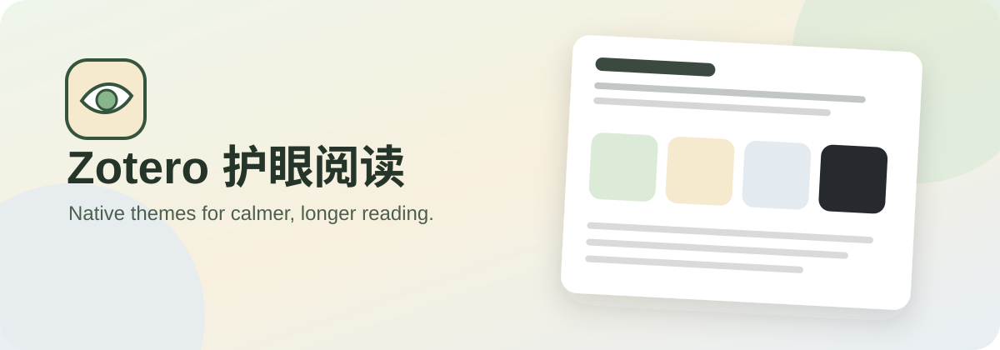
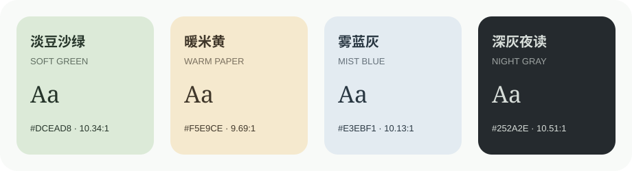
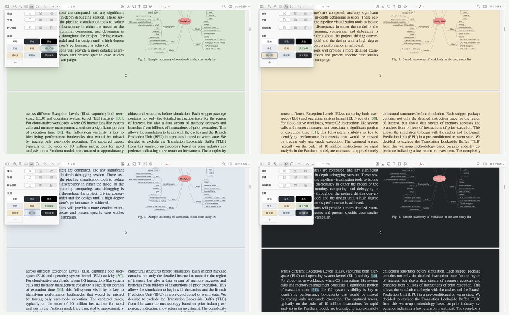
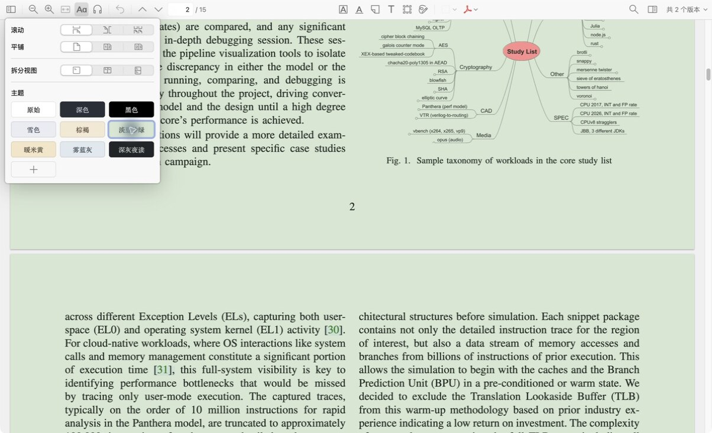

<p align="center">
  
</p>

<p align="center">
  <a href="https://github.com/ZhaoPuEE/zotero-eye-care/releases/latest"></a>
  <a href="https://github.com/ZhaoPuEE/zotero-eye-care/releases/tag/v1.1.0-beta.1"></a>
  
  
  <a href="LICENSE"></a>
</p>

<p align="center"><strong>Softer pages. More attention for the paper.</strong></p>
<p align="center"><a href="README.md">简体中文</a> · English</p>

---

Zotero Eye Care is a tiny theme-preset plugin for **Zotero 9 and 10**. Zotero 9 is the current stable target, and Zotero 10 support is now available as a public beta. It adds four carefully selected palettes to Zotero Reader's native **Appearance → Themes** panel and uses Zotero's existing theme engine and interactions.

> Zotero 9 and 10 include Original, Dark, Black, Snow, and Sepia themes and support custom themes. This plugin adds four tuned eye-care presets and manages their installation, recovery, disable, and uninstall lifecycle.

<p align="center">
  
</p>

## Four reading moods

| Theme | Background | Text | Contrast | Best for |
|---|---:|---:|---:|---|
| Soft Green | `#DCEAD8` | `#26352A` | 10.34:1 | Long daytime reading |
| Warm Paper | `#F5E9CE` | `#40372A` | 9.69:1 | Close reading and warm lighting |
| Mist Blue | `#E3EBF1` | `#293742` | 10.13:1 | Cool displays and figure-heavy papers |
| Night Gray | `#252A2E` | `#D7DDD9` | 10.51:1 | Low-light and nighttime reading |

Every pair exceeds WCAG AA contrast for body text. Images, figures, and annotations keep their original colors.

## Theme preview

Clockwise from the top left: Soft Green, Warm Paper, Night Gray, and Mist Blue.

<p align="center">
  
</p>

The page and text are recolored by Zotero's native reader engine, while colored figures remain intact.

## Why it stays tiny

- **Native by design** — themes live in Zotero's own Appearance panel and use its persistence and sync behavior.
- **Native recoloring** — Zotero 9/10's reader theme engine recolors the page and text.
- **Reader scope** — works with PDF, EPUB, and web snapshots while leaving the library UI unchanged.
- **Lightweight** — zero third-party dependencies, with theme switching handled locally.
- **Compatible lifecycle** — existing custom themes are preserved; disable or uninstall removes only these four presets.

## Install

### Stable · Zotero 9

Download `zotero-eye-care-1.0.0.xpi` from the [latest stable release](https://github.com/ZhaoPuEE/zotero-eye-care/releases/latest).

### Beta · Zotero 10

Download `zotero-eye-care-1.1.0-beta.1.xpi` from the [v1.1.0-beta.1 pre-release](https://github.com/ZhaoPuEE/zotero-eye-care/releases/tag/v1.1.0-beta.1). It is not delivered through the stable update channel. Zotero 10.0.x testers are invited to report their OS, Zotero version, and results in [Issues](https://github.com/ZhaoPuEE/zotero-eye-care/issues).

After downloading:

1. In Zotero, open **Tools → Plugins**.
2. Click the gear menu and choose **Install Plugin From File**.
3. Select the XPI and restart Zotero if prompted.
4. Open a document, click **Appearance**, and pick a new theme.

## Use

After opening a PDF, EPUB, or web snapshot:

1. Click **Appearance (Aa)** in the reader toolbar.
2. Under **Themes**, choose Soft Green, Warm Paper, Mist Blue, or Night Gray.
3. The change applies immediately and Zotero remembers it through its native preference system.

<p align="center">
  
</p>

> Original, Dark, Black, Snow, and Sepia are built into Zotero. The four eye-care presets below them come from this plugin. Zotero's own “+” button remains available for manual custom themes.

> Tested on Zotero 9.0.6 for macOS: installation, all four live theme switches, restart persistence, disable cleanup, and re-enable recovery. Zotero 10.0.x support has passed an API audit against the official documentation and 10.0.1 source and is now collecting real-world results through the beta (see [Compatibility audit](docs/ZOTERO10_COMPATIBILITY.md)).

## Market position

Its focus is **a minimal, curated preset pack built directly on Zotero 9/10's native theme system**.

| Option | Compatibility | Approach | Scope | Position |
|---|---|---|---|---|
| **Zotero Eye Care** | Zotero 9 stable / Zotero 10 beta | Native custom themes | Reader | Four palettes, minimal, zero dependencies |
| [Zotero PDF Background](https://github.com/q77190858/zotero-pdf-background) | ✅ | Injected PDF text-layer CSS | PDF | More controls; README says maintenance has ended |
| [Night for Zotero 9](https://github.com/Zhou-zc-sdu/zotero-night-version-9) | ✅ | Native themes + UI CSS | App and reader | Nord-style UI with three reader modes |
| Zotero 9 built-in | ✅ | Built-in theme engine | Reader | Defaults and manual custom themes, but not this curated set |

See [Market research](docs/MARKET_RESEARCH.md) for the search scope and evidence.

## Develop

No third-party dependencies are required:

```sh
node tests/theme-presets.test.mjs
./build.sh
```

On the beta branch, the XPI is written to `dist/zotero-eye-care-1.1.0-beta.1.xpi`. CI verifies merge/cleanup behavior, JavaScript syntax, manifest JSON, and archive integrity.

## Privacy

The plugin operates only on Zotero's native `readerCustomThemes` setting and requires no network, library, or attachment access.

## License

[MIT](LICENSE) © 2026 ZhaoPuEE
